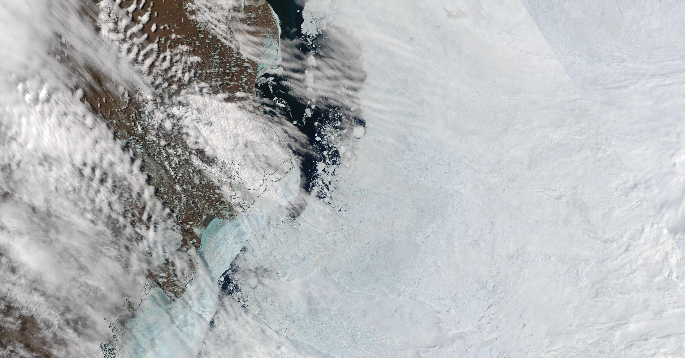

# 6 Seasons

A simple instrument in MAX and Pd to compose music with hydrophone recordings using ambisonics. For in-depth info see [this doc](pdf/6seasons_TENOR23.pdf).

## Requirements

The Pd version relies on iem_ambi package. We use the NK2 hardware by Korg. The MAX version uses Spat5.

## Installation

See README inside each version. Please contact if you wish to use this instrument, we'd be happy to help you set it up.

## Related Projects

- [Lei's Lab](https://lei-lab.ucsd.edu/team/) Lei Liang's org site.
- [WAL](https://www.cetus.ucsd.edu/): WAL site led by John Hildebrand
- [Sonic Arts](https://sonicarts.ucsd.edu/people/index.html): Support from SonicArts

## Credits

John Hildebran, Josh Jones, Lei Liang, Shahrokh Yadegari, Miller Pucketter, Cycling 74', ArtPower UCSD.

## License

[MIT](LICENSE) © [gzalles](https://gzalles.github.io/).
